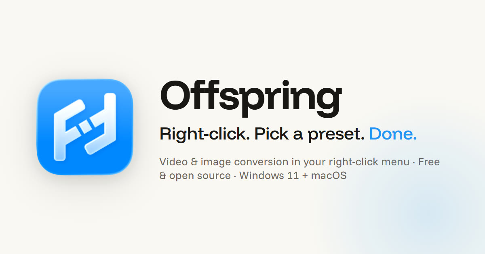

<div align="center">

<a href="https://offspring.secondmarch.xyz">
  
</a>

**Video & image conversion in your right-click menu, powered by FFmpeg.**

**[offspring.secondmarch.xyz](https://offspring.secondmarch.xyz)** ·
[Download](https://github.com/second-march/offspring/releases/latest) ·
made by [Second March](https://secondmarch.xyz/)

</div>

---

Right-click any video or image, pick a preset, and the converted file
lands next to the original — a Discord-ready GIF, a compressed MP4, a
cropped 9:16 vertical, whatever you've shaped. Plus a set of one-click
tools: trim, merge, compare, overlay, greyscale, invert, make-square,
image-sequence handling, and a full Modify dialog with a scrubbable
preview.

Free, MIT-licensed, Windows 11 + macOS. No account, no telemetry — the
app makes **zero outbound requests on its own**.

Screenshots, the full tool list, install steps, and the FAQ all live on
**[the website](https://offspring.secondmarch.xyz)**.

## Docs

- [Security policy](.github/SECURITY.md) — signing, update integrity,
  and the no-automatic-outbound promise
- [Threat model](docs/THREAT_MODEL.md)
- [Releasing](docs/RELEASING.md) — how releases are built and signed
- [Attributions](docs/NOTICE.md) — third-party notices

## FFmpeg licensing

Offspring does **not** bundle or link against FFmpeg — it invokes it as
a separate executable (downloaded on demand into the per-user data
folder, or whatever path you configure in Settings), so FFmpeg's LGPL
does not propagate to Offspring's own code. FFmpeg is © the FFmpeg
developers, licensed under the
[LGPL v2.1+](https://www.ffmpeg.org/legal.html); its source is at
<https://ffmpeg.org/download.html>. Full attributions in
[NOTICE.md](docs/NOTICE.md).

## Building from source

```
npm ci
npm run tauri dev     # run against a local build
npm run tauri build   # release build
```

Requires Node, Rust, and (on Windows) the usual Tauri prerequisites.
See [docs/RELEASING.md](docs/RELEASING.md) for the full
installer/signing pipeline.

## License

[MIT](./LICENSE) © 2026 [Second March](https://secondmarch.xyz/).
